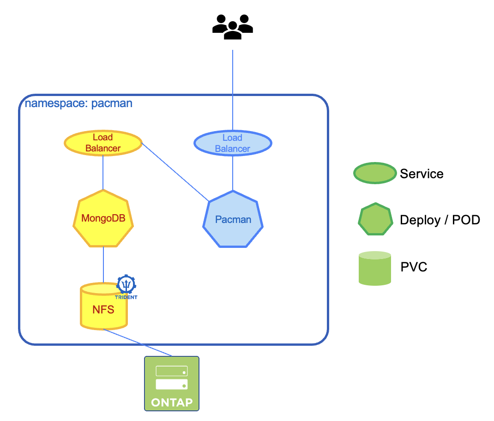

# Hands-on Part 1

## :trident: Scenario 01 - storage classes, persistent volumes & persistent volume claims 
____
**Remember: All required files are in the folder */home/user/tridenttraining/scenario01* please ensure that you are in this folder now. You can do this with the command** 
```console
cd /home/user/tridenttraining/scenario01
```
____
In this scenario, you will create two StorageClasses, discovery their capabilities, create PVCs and do some basic troubleshooting. 
## 1. Backends and StorageClasses
You are using NetApp Astra Trident as the CSI driver in this lab. It is running in the namespace *trident*.
One backend in this environment are allready created. Take a brief moment to review them:

```console
kubectl get tbe -n trident
```

As we've told in the theory session, in many cases just working with NAS protocols is not enough. Therefore we want to create a second backend, so we can use iSCSI too.  
Trident needs to access the ONTAP system and as for every access we need some credentials. Trident supports username & password, certificates and Active-Directory Accounts. To keep it easy we will use username & password.
To avoid having the credentials in plain text, we will create a secret so that they are at least stored encoded in k8s.
The file is allready prepared, let's have a look at it:

```console
cat ontap-svm1-secret.yaml
```

Also we've prepared the backend configuration for you, lets also have a look:

```console
cat san-backend.yaml
```

```yaml
apiVersion: trident.netapp.io/v1
kind: TridentBackendConfig
metadata:
  name: backend-ontap-san
  namespace: trident
spec:
  version: 1
  backendName: svm1-san
  storageDriverName: ontap-san
  managementLIF: 192.168.0.133
  storagePrefix: san_
  credentials:
    name: ontap-svm1-secret
```

There are a lot more options you could provide in a backend configuration and all of them are listed in our documentation. 

Let's see what StorageClasses have already in the cluster 

```console
kubectl get sc
```

It will show you that you have already one storageclas calles sc-nas-svm1. 

You can have a closer look with the following command:

```console
kubectl describe sc sc-nas-svm1
```

Now let's create another StorageClasses. We've already prepared the necessary file. This additional StorageClass will use the iSCSI protocol.

The file is called *rke1_sc_san.yaml*  
The command...

```console
cat rke1_sc_san.yaml
```

...will provide you the following output of the file:

```yaml
apiVersion: storage.k8s.io/v1
kind: StorageClass
metadata:
  name: sc-san-svm1
  annotations:
    storageclass.kubernetes.io/is-default-class: "true"
provisioner: csi.trident.netapp.io
parameters:
  backendType: "ontap-san"
  storagePools: "svm1-san:aggr1_cluster1_02"
  fsType: "ext4"
mountOptions:
   - discard
reclaimPolicy: Retain
allowVolumeExpansion: true
```

You can see the following:
1. This StorageClass will be the default in this cluster (see "annotations")
2. NetApp Astra Trident is responsible for the provisioning of PVCs with this storage class (see "provisioner")
3. There are some parameters needed for this provisioner. In our case we have to tell them the backend type (e.g. nas, san), storagepools and fstype.
4. The reclaim policy is set to "Retain"
5. All volumes that use this StorageClass can be expanded after creation.


If you want to dive into the whole concept of StorageClasses, this is well documented here: https://kubernetes.io/docs/concepts/storage/storage-classes/

After all this theory, let's just add the StoraceClass to your cluster:

```console
kubectl apply -f rke1_sc_san.yaml
```

verify that you now have two StorageClasses:

```console
kubectl get sc
```

Note, as we defined the the sc-san-svm1 as default StorageClass, we now have two default StorageClasses which is an invalid state that unfortunately k8s allows. To specify the right one as default, we have to set one to false again. This can be done by the following command:  

```console
kubectl patch storageclass sc-san-svm1 -p '{"metadata": {"annotations":{"storageclass.kubernetes.io/is-default-class":"false"}}}'
```

You should now only have one StorageClass marked as default, verify it and continue. 

## 2. PVCs & PVs

As your cluster now has a CSI driver installed and also StorageClasses configured, you are all set to ask for storage. But don't be afraid. You will not have to open a ticket at your storage admin team or do some weird storage magic. We want a persistent volume, so let's claim one.  
The workflow isn't complex but important to understand. 

1. A user creates a PersistentVolumeClaim requesting a new PersistentVolume of a particular size from a Kubernetes StorageClass that was previously configured by someone.
2. The Kubernetes StorageClass identifies the CSI driver - in our case Trident - and includes parameters that tell Trident how to provision a volume for the requested class.
3. Trident provisions storage on a matching backend and creates a PersistentVolume in Kubernetes that tells Kubernetes how to find, mount, and treat the volume.
4. Kubernetes binds the PersistentVolumeClaim to the new PersistentVolume. Pods that include the PersistentVolumeClaim can now mount the PersistentVolume on any host that they runs on.

There are two files in your scenario01 folder, *firstpvc.yaml* and *secondpvc.yaml*, both a requesting a 5GiB Volume. Let's create a namespace first, called *funwithpvcs*. We then get the storage into this namespace...

```console
kubectl create namespace funwithpvcs
kubectl apply -f firstpvc.yaml -n funwithpvcs
kubectl apply -f secondpvc.yaml -n funwithpvcs
```

Kubernetes confirms, that both persistent volume claimes have been created. Great... or not? Let's have a look

```console
kubectl get pvc -n funwithpvcs
```

You can see that the PVC named *firstpvc* has a volume, and is in status *Bound*. The PVC with the name *secondpvc*  does not look that healthy, it is still in Status *Pending*. This means that the request is ongoing, K8s tries to get what you want, but for whatever reason it doesn't work.   
Luckily we can describe objects and see what the problem is!

```console
kubectl describe pvc secondpvc -n funwithpvcs
```

Ok we can see, that there is an issue with the StorageClass. But why?  
Everything that is requested in the PVC will be handed over to the provisioner that is defined in the StorageClass. In this case Trident gets a request for a RWX volume with 5GiB and for the backend "ontap-san".   
In contrast to K8s, the CSI Driver is aware what is possible and what not. It recognizes that a RWX volume isn't possible at this backend type (SAN/block storage) as this backend can only serve RWO and ROX. 

If you want to have your second pvc also running and still need RWX access mode, we have to modify the yaml file. Just switch the storage class to *sc-nas-svm1*. This StorageClass has a backend type that is able to provide RWX mode. Unfortunately a lot of things in a PVC are immutable after creation so before we can see whether this change is working or not, you have to delete the pvc again.
___
<details><summary>Click for the solution</summary>
Delete the pvc which is in pending state:

```console
kubectl delete -f secondpvc.yaml -n funwithpvcs
```

Edit the *secondpvc.yaml* file like this:

```yaml
apiVersion: v1
kind: PersistentVolumeClaim
metadata:
  name: secondpvc
spec:
  accessModes:
  - ReadWriteMany
  resources:
    requests:
      storage: 5Gi
  storageClassName: sc-nas-svm1
```
Apply the pvc again

```console
kubectl apply -f secondpvc.yaml -n funwithpvcs
```
</details>

___

After you have deleted the PVC, changed the StorageClass in the pvc file and applied it again, you should see that both pvcs are now bound.


```console
kubectl get pvc -n funwithpvcs
```


```sh
NAME        STATUS   VOLUME                                     CAPACITY   ACCESS MODES   STORAGECLASS      AGE
firstpvc    Bound    pvc-542ed6d9-6df6-4d00-8bea-57f0de4999ad   5Gi        RWO            sc-san-svm1       4m15s
secondpvc   Bound    pvc-e3ec31a7-abf4-4223-a12d-3fc674e03cb9   5Gi        RWX            sc-nas-svm1       12s
```

Earlier we mentioned that a *PersistentVolume* is also created. Maybe you ask yourself where to see them. It is pretty easy, let's have a look at our recently created ones:

```console
kubectl get pv | grep funwithpvcs
```

```sh
pvc-05e82aee-759a-42a5-9bea-e85cdbea9f8b   5Gi        RWO            Retain           Bound    funwithpvcs/firstpvc                                        sc-san-svm1                85s
pvc-d5db069f-e7a8-45f6-bd78-11a11dd9f178   5Gi        RWX            Delete           Bound    funwithpvcs/secondpvc                                       sc-nas-svm1                82s
```

You remember the ReclaimPolicy we definied in our StorageClass? We can see here that pur PVs have different policies. Let's delete both PVCs and see what happens.

```console
kubectl delete -f firstpvc.yaml -n funwithpvcs
kubectl delete -f secondpvc.yaml -n funwithpvcs
```

Let's have a look at PVCs and PVs now 

```console
kubectl get pvc -n funwithpvcs
kubectl get pv | grep funwithpvcs
```

Magic, both PVCs are gone (well... we advised k8s to remove them...) but one PV is still there? No not real magic, just the normal behaviour of the specified ReclaimPolicy. As described before, the default ReclaimPolicy is *Delete*. This means as soon as the corresponding PVC is deleted, the PV will be deleted too. In some use cases this would delete valuable data. To avoid this, you can set the ReclaimPolicy to *Retain*. If the PVC is deleted now, the PV will change its Status from *Bound* to *Released*. The PV could be used again.  
Important to know: It is specified in the [Kubernetes Documentation](https://kubernetes.io/docs/concepts/storage/persistent-volumes/#retain) that "retain" also means that you have to delete the storage assets manually. A lot of people are not aware of this kubernetes behavior which could lead to orphaned data on the storage, only the storage administrator is aware of. To avoid this, always patch the retention policy of the PV to "delete" before it is deleted in kubernetes.

Awesome, you are now able to request storage...but as long as no appliaction is using that, there is no real sense of having persistent storage. Let's create an application that is able to do something with the storage. We don't want to show just the next Wordpress Demo and we want to have some fun. Due to this, we will now bring Pac-Man to Kubernetes.  

<p align="center"></p>

As you can see in the architecture picture, this app consists out of several parts. 
There are two services. One will expose the mongodb to the network, the other will expose the app to the network. Then we have our two deployments, one for the mongo-db the other is the application. Last but not least, our pvc where we ask for persistent storage, that is consumed by the mongo-db to store our very valuable data.
To make it more verbose for you, we've splitted all the parts into seperate files that are in your working directory and start with pacman-... We will start with deploying the database and then continue with the application itself.

First we need a place where Pac-Man can live. In Kubernetes, this is the namespace.

```console
kubectl create namespace pacman
```

Now let's start with deploying the storage we need for the mongo-db. Take a look at the file and create it afterwars

Have a look at the file for the pvc and create it afterwards:

```console
cat pacman-mongodb-pvc.yaml
kubectl apply -f pacman-mongodb-pvc.yaml -n pacman
```

You can verfiy that the pvc is there and bound:

```console
kubectl get pvc -n pacman
```

Now as the PVC is there, have a look at the file for the database deployment and create it afterwards:

```console
cat pacman-mongodb-deployment.yaml
kubectl apply -f pacman-mongodb-deployment.yaml -n pacman
```

You should be able to see the container running:

```console
kubectl get pods -n pacman
```

We have a running container, we have storage for the mongodb, now we need a service that the app can access the database. Have a look at the file and create them afterwards:

```console
cat pacman-mongodb-service.yaml
kubectl apply -f pacman-mongodb-service.yaml -n pacman
```

You should have now one service in your namespace:

```console
kubectl get svc -n pacman
```

Let's continue with the pacman application, we will start with the deployment, as there is no need for storage (remeber: we will store the data in the database). Have look at the file for the deployment and create it afterwards:

```console
cat pacman-app-deployment.yaml
kubectl apply -f pacman-app-deployment.yaml -n pacman
```

You should be able to see the containers running:

```console
kubectl get pods -n pacman
```

We have running containers, we have storage for the mongodb, we have connection between mongodb and the pacman application guess what is missing: A service to access pacman. Have a look at the files for the service and create it afterwards:

```console
cat pacman-app-service.yaml
kubectl apply -f pacman-app-service.yaml -n pacman 
```

Finaly let's check the services:

```console
kubectl get svc -n pacman
```  


```console
NAME     TYPE           CLUSTER-IP       EXTERNAL-IP     PORT(S)           AGE
mongo    LoadBalancer   172.26.223.182   192.168.0.215   27017:30967/TCP   16s
pacman   LoadBalancer   172.26.164.251   192.168.0.216   80:30552/TCP      14s  
```  

In my example, Pac-Man recieved the external IP 192.168.0.216. This IP adress may vary in your environment. Take the IP adress from your output, open the webbrowser in your jumphost and try to access Pac-Man

Have some fun, create some highscore, we will need that in a later lab.

## :trident: Scenario 02 - running out of space? Let's expand the volume 
____
**Remember: All required files are in the folder */home/user/tridenttraining/scenario02* please ensure that you are in this folder now. You can do this with the command** 
```console
cd /home/user/tridenttraining/scenario02
```
____
Sometimes you need more space than you thought before. For sure you could create a new volume, copy the data and work with the new bigger PVC but it is way easier to just expand the existing.

First let's check the StorageClasses

```console
kubectl get sc 
```

Look at the column *ALLOWVOLUMEEXPANSION*. As we specified earlier, all StorageClasses are set to *true*, which means PVCs that are created with this StorageClass can be expanded.  
NFS Resizing was introduced in K8S 1.11, while iSCSI resizing was introduced in K8S 1.16 (CSI)

Now let's create a PVC and a Centos POD using this PVC, in their own namespace called *resize".

```console
kubectl create namespace resize
kubectl apply -n resize -f pvc.yaml
kubectl apply -n resize -f pod-busybox-nas.yaml
```

Wait until the pod is in running state - you can check this with the command

```console
kubectl get pod -n resize
```

Finaly you should be able to see that the 5G volume is indeed mounted into the POD

```console
kubectl -n resize exec busyboxfile -- df -h /data
```

Resizing a PVC can be done in different ways. We will edit the original yaml file of the PVC & apply it again it.  
Look for the *storage* parameter in the spec part of the definition & change the value (in this example, we will use 15GB)
The provided command will open the pvc definition.

```console
vi pvc.yaml
```

change the size to 15Gi like in this example:

```yaml
spec:
  accessModes:
  - ReadWriteMany
  resources:
    requests:
      storage: 15Gi
  storageClassName: storage-class-nas
  volumeMode: Filesystem
```

you can insert something by pressing "i", exit the editor by pressing "ESC", type in :wq! to save&exit. 

After this just apply the pvc.yaml file again  

```console
kubectl apply -n resize -f pvc.yaml
```

Everything happens dynamically without any interruption. The results can be observed with the following commands:

```console
kubectl -n resize get pvc
kubectl -n resize exec busyboxfile -- df -h /data
```

This could also have been achieved by using the *kubectl patch* command. Try the following:

```console
kubectl patch -n resize pvc pvc-to-resize-file -p '{"spec":{"resources":{"requests":{"storage":"20Gi"}}}}'
```

So increasing is easy, what about decreasing? Try to set your volume to a lower space, use the edit or the patch mechanism from above.
___

<details><summary>Click for the solution</summary>

```console
kubectl patch -n resize pvc pvc-to-resize-file -p '{"spec":{"resources":{"requests":{"storage":"2Gi"}}}}'
```
</details>

___

Even if it would be technically possible to decrease the size of a NFS volume, K8s just doesn't allow it. So keep in mind: Bigger ever, smaller never. 

If you want to, clean up a little bit:

```console
kubectl delete namespace resize
```
