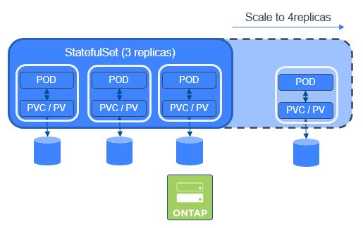
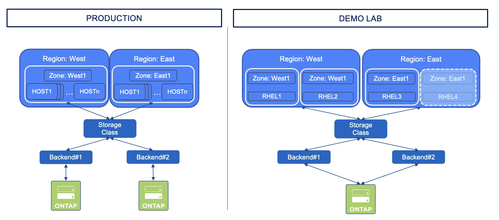

## Hands-on Part 2

**GOAL:**  
StatefulSets work differently that Deployments or DaemonSets when it comes to storage.  
Deployments & DaemonSets use PVC defined outside of them, whereas StatefulSets include the storage in their definition (cf _volumeClaimTemplates_).  
Said differently, you can see a StatefulSet as a couple (POD + Storage). When it is scaled, both objects will be automatically created.  
In this exercise, we will create a MySQL StatefulSet & Scale it.  

<p align="center"></p>

____
**Remember: All required files are in the folder */home/user/tridenttraining/scenario03* please ensure that you are in this folder now. You can do this with the command** 
```console
cd /home/user/tridenttraining/scenario03
```
____

## 1. Let's start by creating the application

This application is based on 3 elements:

- a ConfigMap, which hosts some parameter for the application
- 2 services
- the StatefulSet (3 replicas of the application)

:mag:  
*A* **ConfigMap** *is an API object used to store non-confidential data in key-value pairs. Pods can consume ConfigMaps as environment variables, command-line arguments, or as configuration files in a volume. A ConfigMap allows you to decouple environment-specific configuration from your container images, so that your applications are easily portable.*  
:mag_right:  

```bash
kubectl create namespace mysql
kubectl create -n mysql -f mysql-configmap.yaml
kubectl create -n mysql -f mysql-services.yaml
kubectl create -n mysql -f mysql-statefulset.yaml
```

It will take a few minutes for all the replicas to be created, I will then suggest using the _watch_ flag:

```bash
kubectl -n mysql get pod --watch
```
This will rerun your command again and again and watch for changes in the output. If there are any, it will write those in one new line.
```bash
mysql-0   1/2     Running   0          43s   10.36.0.1   rhel1   <none>           <none>
mysql-0   2/2     Running   0          52s   10.36.0.1   rhel1   <none>           <none>
mysql-1   0/2     Pending   0          0s    <none>      <none>   <none>           <none>
mysql-1   0/2     Pending   0          0s    <none>      <none>   <none>           <none>
mysql-1   0/2     Pending   0          4s    <none>      rhel2    <none>           <none>
mysql-1   0/2     Init:0/2   0          4s    <none>      rhel2    <none>           <none>
mysql-1   0/2     Init:1/2   0          24s   10.44.0.1   rhel2    <none>           <none>
mysql-1   0/2     Init:1/2   0          32s   10.44.0.1   rhel2    <none>           <none>
mysql-1   0/2     PodInitializing   0          40s   10.44.0.1   rhel2    <none>           <none>
...
```

Once you verified that the third POD is up & running, you are good to go


Now, check the storage. You can see that 3 PVC were created, one per POD.

```bash
kubectl get -n mysql pvc
```
```bash
NAME                                 STATUS   VOLUME                                     CAPACITY   ACCESS MODES   STORAGECLASS        AGE
persistentvolumeclaim/data-mysql-0   Bound    pvc-f348ec0a-f304-49d8-bbaf-5a85685a6194   10Gi       RWO            storage-class-nas   5m
persistentvolumeclaim/data-mysql-1   Bound    pvc-ce114401-5789-454a-ba1c-eb5453fbe026   10Gi       RWO            storage-class-nas   5m
persistentvolumeclaim/data-mysql-2   Bound    pvc-99f98294-85f6-4a69-8f50-eb454ed00868   10Gi       RWO            storage-class-nas   4m
```
## 2. Let's write some data in this database !

To connect to MySQL, we will use another POD which will connect to the master DB (mysql-0).  
Copy & paste the whole block at once:

```bash
kubectl run mysql-client -n mysql --image=quay.io/trident-mirror/kcduk/mysql:5.7.30 -i --rm --restart=Never -- mysql -h mysql-0.mysql <<EOF
CREATE DATABASE test;
CREATE TABLE test.messages (message VARCHAR(250));
INSERT INTO test.messages VALUES ('hello');
EOF
```

Let's check that the operation was successful by reading the database, through the service called _mysql-read_

```bash
kubectl run mysql-client -n mysql --image=quay.io/trident-mirror/kcduk/mysql:5.7.30 -i -t --rm --restart=Never -- mysql -h mysql-read -e "SELECT * FROM test.messages"
```

If you don't see a command prompt, try pressing enter. If everything has worked, you should see the following output:
```bash
+---------+
| message |
+---------+
| hello   |
+---------+
pod "mysql-client" deleted
```

## 3. Where are my reads coming from ?

In the current setup, _writes_ are done on the master DB, wheareas _reads_ can come from any DB POD.  
Let's check this!  
First, open a new Terminal tab (File --> Open Tab). You can then run the following, which will display the ID of the database followed by a timestamp. 

```bash
kubectl run mysql-client-loop -n mysql --image=quay.io/trident-mirror/kcduk/mysql:5.7.30 -i -t --rm --restart=Never -- bash -ic "while sleep 1; do mysql -h mysql-read -e 'SELECT @@server_id,NOW()'; done"
```

```bash
+-------------+---------------------+
| @@server_id | NOW()               |
+-------------+---------------------+
|         100 | 2020-04-07 10:22:32 |
+-------------+---------------------+
+-------------+---------------------+
| @@server_id | NOW()               |
+-------------+---------------------+
|         102 | 2020-04-07 10:22:33 |
+-------------+---------------------+
```

As you can see, _reads_ are well distributed between all the PODs.  
Keep this tab open but switch back to the first tab for now...

## 4. Let's scale !

Scaling an application with Kubernetes is pretty straightforward & can be achieved with the following command:

```bash
kubectl scale statefulset mysql -n mysql --replicas=4
```
```bash
statefulset.apps/mysql scaled
```

You can use the _kubectl get pod_ with the _--watch_ parameter again to see the new POD starting.  
When done, you should have someething similar to this:

```bash
kubectl get pod -n mysql
```
```bash
NAME      READY   STATUS    RESTARTS   AGE
mysql-0   2/2     Running   0          12m
mysql-1   2/2     Running   0          12m
mysql-2   2/2     Running   0          11m
mysql-3   2/2     Running   1          3m13s
```

Notice the last POD is _younger_ that the other ones...  
Again, check the storage. You can see that a new PVC was automatically created.

```bash
kubectl get -n mysql pvc
```
```bash
NAME                                 STATUS   VOLUME                                     CAPACITY   ACCESS MODES   STORAGECLASS        AGE
persistentvolumeclaim/data-mysql-0   Bound    pvc-f348ec0a-f304-49d8-bbaf-5a85685a6194   10Gi       RWO            storage-class-nas   15m
persistentvolumeclaim/data-mysql-1   Bound    pvc-ce114401-5789-454a-ba1c-eb5453fbe026   10Gi       RWO            storage-class-nas   15m
persistentvolumeclaim/data-mysql-2   Bound    pvc-99f98294-85f6-4a69-8f50-eb454ed00868   10Gi       RWO            storage-class-nas   14m
persistentvolumeclaim/data-mysql-3   Bound    pvc-8758aaaa-33ab-4b6c-ba42-874ce6028a49   10Gi       RWO            storage-class-nas   6m18s
```

Also, if the second tab is still open, you should start seeing new _id_ ('103' anyone?):

```bash
+-------------+---------------------+
| @@server_id | NOW()               |
+-------------+---------------------+
|         102 | 2020-04-07 10:25:51 |
+-------------+---------------------+
+-------------+---------------------+
| @@server_id | NOW()               |
+-------------+---------------------+
|         103 | 2020-04-07 10:25:53 |
+-------------+---------------------+
+-------------+---------------------+
| @@server_id | NOW()               |
+-------------+---------------------+
|         101 | 2020-04-07 10:25:54 |
+-------------+---------------------+
```

## 5. Clean up

```bash
kubectl delete namespace mysql
```
```bash
namespace "mysql" deleted
```

#########################################################################################
# SCENARIO 04: CSI Topology
#########################################################################################

**GOAL:**  

Some details about CSI Topology:

- Kubernetes details: https://kubernetes-csi.github.io/docs/topology.html

This feature allows you to segment nodes of a Kubernetes cluster into sub-groups, so that you can manage:
- their location (Rack#1 vs Rack#2, Zone#1 vs Zone#2, DC#1 vs DC#2...)
- their target use (Production vs Dev)
- ...

In a real environment, you will probably use a different storage platform in each zone. To simplify the configuration of this scenario, we will use the same storage backend to host volumes from both zones, while using different prefixes, in order to simulate having two different zones or datacenters.

<p align="center"></p>

____
**Remember: All required files are in the folder */home/user/tridenttraining/scenario04* please ensure that you are in this folder now. You can do this with the command** 
```console
cd /home/user/ridenttraining/scenario04
```
____


The Kubernetes nodes are already labeled with region and zone information. Check out the topology labels:

```console
kubectl get nodes --show-labels
```


We are going to create two new Trident backends, each one pointing to a different region.  
You can see in the yaml files that we use a parameter called **supportedTopologies** to specify this.
This is specific to the Trident CSI driver and will be different, depending on the CSI driver you are using.

Let's have a look at one of the backends:
```bash
cat backend-east.yaml
```
```yaml
apiVersion: v1
kind: Secret
metadata:
  name: backend-ontap
type: Opaque
stringData:
  username: vsadmin
  password: Netapp1!
---
apiVersion: trident.netapp.io/v1
kind: TridentBackendConfig
metadata:
  name: backend-tbc-ontap-nas-east
spec:
  version: 1
  backendName: nas-east
  storageDriverName: ontap-nas
  managementLIF: 192.168.0.133
  storagePrefix: east_
  credentials:
    name: backend-ontap
  supportedTopologies:
    - topology.kubernetes.io/region: east
    - topology.kubernetes.io/zone: east1
```

As you can see, we've specified this backend to be used for the region "east" and the zone "east1"

Now let's create both backends.

```bash
kubectl create -n trident -f backend-east.yaml 
kubectl create -n trident -f backend-west.yaml
```

We can now create a Kubernetes Storage Class that does not necessarily point to a particular Trident Backend.  
We will use the _sc_topology.yaml_ file which refers to both regions & zones. One could decide to implement separate storage classes (1 for each region), however, letting Trident decide where to create the volume based on one single Storage Class is easier to manage.

Before using it, let's have a quick look:

```bash
cat sc-topology.yaml
```
```yaml
apiVersion: storage.k8s.io/v1
kind: StorageClass
metadata:
  name: sc-topology
provisioner: csi.trident.netapp.io
volumeBindingMode: WaitForFirstConsumer
allowedTopologies:
- matchLabelExpressions:
  - key: topology.kubernetes.io/zone
    values:
    - east1
    - west1
  - key: topology.kubernetes.io/region
    values:
    - east
    - west
parameters:
  backendType: "ontap-nas"
  storagePools: "nas-east:aggr1;nas-west:aggr1"
```

As you can see, this sc will care about the zones "east1", "west1" and the regions "east", "west".
You will also notice that these is a specific optional parameter in this storage class: **volumeBindingMode** set to _WaitForFirstConsumer_ (default value: _Immediate_).  This means that the PVC will not be created until referenced in a POD.  

Create the sc and have a look at the result:

```bash
kubectl create -f sc-topology.yaml
```
```bash
kubectl get sc
```
```bash
NAME                 PROVISIONER             RECLAIMPOLICY   VOLUMEBINDINGMODE      ALLOWVOLUMEEXPANSION   AGE
sc-topology          csi.trident.netapp.io   Delete          WaitForFirstConsumer   false                  6m39s
```

Let's use a specific namespace for this scenario:  

```bash
kubectl create ns topology
```

This directory contains 2 sets of PVC/POD, one for each region. Let's start by creating the PVC:

```bash
kubectl create -n topology -f pvc_east.yaml
kubectl create -n topology -f pvc_west.yaml
kubectl get pvc -n topology
```

```bash
NAME              STATUS    VOLUME             CAPACITY   ACCESS MODES   STORAGECLASS    AGE
pvc-east          Pending                                                sc-topology     2s
pvc-west          Pending                                                sc-topology     2s
```

As you can see, both PVC have not yet been created, simply because of the _volumeBindingMode_ parameter set in the storage class. Let's have a closer look:

```bash
kubectl describe -n topology pvc pvc-west | grep -C 3 Events
```
```bash
Access Modes:
VolumeMode:    Filesystem
Mounted By:    <none>
Events:
  Type    Reason                Age                  From                         Message
  ----    ------                ----                 ----                         -------
  Normal  WaitForFirstConsumer  56s (x142 over 36m)  persistentvolume-controller  waiting for first consumer to be created before binding
```

Let's create two applications.  
If you take a look the POD yaml files, you will notice I have used the **nodeAffinity** parameters to also define where the POD would be created.

As expected:

- the **WEST** Pod should run on either **worker1** or **worker2**
- the **EAST** Pod should run on **worker3** 

```bash
kubectl create -n topology -f pod-busybox-west.yaml
kubectl create -n topology -f pod-busybox-east.yaml
```

Now that the PODs have been requested, you can also see that both PVC have been succesfully created.

```bash
kubectl get pvc -n topology
```
```bash
NAME         STATUS   VOLUME                                     CAPACITY   ACCESS MODES   STORAGECLASS     AGE
pvc-east     Bound    pvc-d0a8aa71-840b-4248-92d6-850b680988a3   5Gi        RWX            sc-topology      15h
pvc-west     Bound    pvc-f468c589-1a88-4393-a827-f6bd0b4c1902   5Gi        RWX            sc-topology      15h
```

Finally, let's check that our 2 PODs have been created on the right hosts, as expected:

```bash
kubectl get pod -n topology -o wide
```
```bash
NAME              READY   STATUS    RESTARTS   AGE     IP          NODE                         NOMINATED NODE   READINESS GATES
busybox-east      1/1     Running   0          97s     10.44.0.8   worker3.rke1.demo.netapp.com   <none>           <none>
busybox-west      1/1     Running   0          92s     10.36.0.5   worker1.rke1.demo.netapp.com   <none>           <none>
```

# TODO include check on storage to see that the volumes have been created with different prefixes!!!
Last check, each volume in ONTAP should have a prefix related to its region:

```bash
ssh cluster1 vol show -vserver svm1 -volume *st_pvc*
```

## Cleanup the environment

```bash
$ kubectl delete namespace topology
namespace "topology" deleted
```
