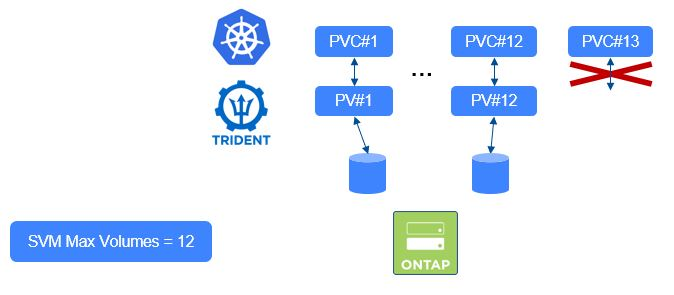
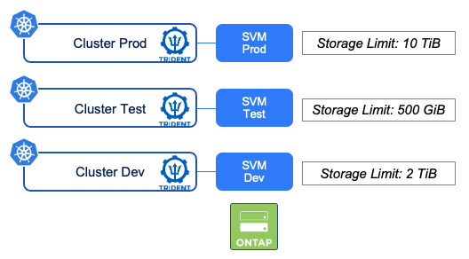

# Hands-on Part 3

## :trident: Scenario 05 -  snapshots, clones etc 
___
**Remember: All required files are in the folder */home/user/tridenttraining/scenario05*. Please ensure that you are in this folder. You can do this with the command** 
```console
cd /home/user/tridenttraining/scenario05
```
___
CSI Snapshots have been promoted GA with Kubernetes 1.20.  
While snapshots can be used for many use cases, we will explore 2 different ones, which share the same initial process:

- Restore the snapshot in the current application
- Create a new POD which uses a PVC created from the snapshot (cloning)

There is also a chapter that will show you the impact of deletion between PVC, Snapshots & Clones (spoiler alert: no impact).  

We would recommended checking that the CSI Snapshot feature is actually enabled on this platform.  

This [link](https://github.com/kubernetes-csi/external-snapshotter) is a good read if you want to know more details about installing the CSI Snapshotter.
It is the responsibility of the Kubernetes distribution to provide the snapshot CRDs and Controller. Unfortunately some distributions do not include this. Therefore verify (and deploy it yourself if needed).

In our lab the **CRD** & **Snapshot-Controller** to enable this feature have already been installed. Let's see what we find:

```console
kubectl get crd | grep volumesnapshot
```

will show us the crds

```bash
volumesnapshotclasses.snapshot.storage.k8s.io         2020-08-29T21:08:34Z
volumesnapshotcontents.snapshot.storage.k8s.io        2020-08-29T21:08:55Z
volumesnapshots.snapshot.storage.k8s.io               2020-08-29T21:09:13Z
```

```console
kubectl get pods --all-namespaces -o=jsonpath='{range .items[*]}{"\n"}{range .spec.containers[*]}{.image}{", "}{end}{end}' | grep snapshot-controller
```

will show us the snapshot controller is running in our cluster:

```bash
k8s.gcr.io/sig-storage/snapshot-controller:v4.2.0,
k8s.gcr.io/sig-storage/snapshot-controller:v4.2.0,
```

Aside from the 3 CRDs & the Controller StatefulSet, the following objects have also been created during the installation of the CSI Snapshot feature:

- serviceaccount/snapshot-controller
- clusterrole.rbac.authorization.k8s.io/snapshot-controller-runner
- clusterrolebinding.rbac.authorization.k8s.io/snapshot-controller-role
- role.rbac.authorization.k8s.io/snapshot-controller-leaderelection
- rolebinding.rbac.authorization.k8s.io/snapshot-controller-leaderelection

Finally, you need to have a *VolumeSnapshotClass* object that connects the snapshot capability with the Trident CSI driver. In this Lab there is already one:

```console
kubectl get volumesnapshotclass
```

Note that the *deletionpolicy* parameter could also be set to *Retain*.

The _volume snapshot_ feature is now ready to be tested.

The following will walk you through the management of snapshots with a simple lightweight BusyBox container.

We've prepared all the necessary files for you to save a little time. Please prepare the environment with the following commands:

```console
kubectl create namespace busybox
kubectl apply -n busybox -f busybox.yaml
kubectl get -n busybox all,pvc
```

The last line will provide you an output of our example environment. There should be one running pod and a pvc with 10Gi.

Before we create a snapshot, let's write some data into our volume.  

```console
kubectl exec -n busybox $(kubectl get pod -n busybox -o name) -- sh -c 'echo "Hello little Container, it's me Trident. I will care about your persistent data" > /data/test.txt'
```

This creates the file test.txt and writes "Hello little Container, it's me Trident. I will care about your persistent data" into it. You can verify the file contents:

```console
kubectl exec -n busybox $(kubectl get pod -n busybox -o name) -- more /data/test.txt
```

Creating a snapshot of this volume is very simple:

```console
kubectl apply -n busybox -f pvc-snapshot.yaml
```

After it is created you can observe its details:
```console
kubectl get volumesnapshot -n busybox
```
Your snapshot has been created !  

To experiment with the snapshot, let's delete our test file...
```console
kubectl exec -n busybox $(kubectl get pod -n busybox -o name) -- rm -f /data/test.txt
```

If you want to verify that the data is really gone, feel free to try out the command from above that has shown you the contents of the file:

```console
kubectl exec -n busybox $(kubectl get pod -n busybox -o name) -- more /data/test.txt
```

One of the useful things K8s provides for snapshots is the ability to create a clone from it. 
If you take a look a the PVC manifest (_pvc_from_snap.yaml_), you can notice the reference to the snapshot:

```yaml
dataSource:
  name: mydata-snapshot
  kind: VolumeSnapshot
  apiGroup: snapshot.storage.k8s.io
```

Let's see how that turns out:

```console
kubectl apply -n busybox -f pvc_from_snap.yaml
```

This will create a new pvc which could be used instantly in an application. You can see it if you take a look at the pvcs in your namespace:

```console
kubectl get pvc -n busybox
```

Recover the data of your application

When it comes to data recovery, there are many ways to do so. If you want to recover only a single file, you can temporarily attach a PVC clone based on the snapshot to your pod and copy individual files back. Some storage systems also provide a convenient access to snapshots by presenting them as part of the filesystem (feel free to exec into the pod and look for the .snapshot folders on your PVC). However, if you want to recover everything, you can just update your application manifest to point to the clone, which is what we are going to try now:

```console
kubectl patch -n busybox deploy busybox -p '{"spec":{"template":{"spec":{"volumes":[{"name":"volume","persistentVolumeClaim":{"claimName":"mydata-from-snap"}}]}}}}'
```

That will trigger a new POD creation with the updated configuration. Wait a few seconds until the new pod is running.

Now, if you look at the files this POD has access to (the PVC), you will see that the *lost data* (file: test.txt) is back!

```console
kubectl exec -n busybox $(kubectl get pod -n busybox -o name) -- ls -l /data/
```
or even better, lets have a look at the contents:

```console
kubectl exec -n busybox $(kubectl get pod -n busybox -o name) -- more /data/test.txt
```

Tadaaa, you have restored your data!  
Keep in mind that some applications may need some extra care once the data is restored (databases for instance). In a production setup you'll likely need a more full-blown backup/restore solution.  


Now, a little clean up at the end:

```console
kubectl delete ns busybox
```

## :trident: Scenario 06 - Consumption control in Kubernetes
___
**Remember: All required files are in the folder */home/user/tridenttraining/scenario06*. Please ensure that you are in this folder. You can do this with the command**


```console
cd /home/user/tridenttraining/scenario06
```
___
There are many different ways to control the storage consumption. We will focus on the possibilities of K8s itself. However please remember: Sometimes the same thing can also be achieved at storage or csi driver level and it might be preferred to do it there.

You can create different objects to control the storage consumption directly in Kubernetes:

- LimitRange: controls the maximum (& minimum) size for each claim in a namespace
- ResourceQuotas: limits the number of PVC or the amount of cumulative storage in a namespace

For this scenario we will create and work in the namespace *control*.

You will create two types of quotas:

1. Limit the number of PVC a user can create
2. Limit the total capacity a user can consume

Take a look at _rq-pvc-count-limit.yaml_ and _rq-sc-resource-limit.yaml_ and then apply them:

```console
kubectl create namespace control
kubectl apply -n control -f rq-pvc-count-limit.yaml
kubectl apply -n control -f rq-sc-resource-limit.yaml
```

You can see the specified ressource quotas with the following command:

```console
kubectl get resourcequota -n control
```

Nice, they are there - but what do they do? Let's take a closer look:

```console
kubectl describe quota pvc-count-limit -n control
```

Ok we see some limitations... but how do they work? Let's create some PVCs to find out

```console
kubectl apply -n control -f pvc-quotasc-1.yaml
kubectl apply -n control -f pvc-quotasc-2.yaml
```

Again, have a look at the ressource limits:

```console
kubectl describe quota pvc-count-limit -n control
```

Two in use, great, let's add a third one

```console
kubectl apply -n control -f pvc-quotasc-3.yaml
```

So far so good, all created, a look at our limits tells you that you got the maximum number of PVC allowed for this storage class. Let's see what happens next...

```console
kubectl apply -n control -f pvc-quotasc-4.yaml
```

Oh! An Error... well that's what we expected as we want to limit the creation, right?
Before we continue, let's clean up a little bit:

```console
kubectl delete pvc -n control --all
```

Time to look at the capacity quotas...

```console
kubectl describe quota sc-resource-limit -n control
```

Each PVC you are going to use is 5GB.

```console
kubectl apply -n control -f pvc-5Gi-1.yaml
```

A quick check:

```console
kubectl describe quota sc-resource-limit -n control
```

Given the size of the second PVC file, the creation should fail in this namespace

```console
kubectl apply -n control -f pvc-5Gi-2.yaml
```

And as expected, our limits are working. 

Before starting the second part of this scenario, let's clean up

```console
kubectl delete pvc -n control 5gb-1
kubectl delete resourcequota -n control --all
```

We will use the LimitRange object type to control the maximum size of the volumes a user can create in this namespace. 

```console
kubectl apply -n control -f lr-pvc.yaml
```

Let's verify:

```console
kubectl describe -n control limitrange storagelimits
```

Now that we have create a 2Gi limit, let's try to create a 5Gi volume...

```console
kubectl apply -n control -f pvc-5Gi-1.yaml
```

Magical, right?  

## :trident: Scenario 07 - Consumption control in Trident
___
**Remember: All required files are in the folder */home/user/tridenttraining/scenario07*. Please ensure that you are in this folder. You can do this with the command**

```console
cd /home/user/tridenttraining/scenario07
```

You have two options to control space within Trident:

- Backend parameter _limitVolumeSize_
- Backend parameter _limitAggregateUsage_

_limitAggregateUsage_ has two major disadvantages which hit mainly in shared environments:

1. It does not refer to the space used only by Trident, but really the overall space (example: limit set to 50%, aggregate already filled up to 45% by a virtualized environment: 5% left for Trident)
2. It requires CLUSTER ADMIN credentials

Due to this, the setting _limitAggregateUsage_ is rarely used.

In contrast, _limitVolumeSize_ is often utilized to get better control.
Depending on the driver, this parameter will

1. control the PVC Size (ex: driver ONTAP-NAS)
2. control the size of the ONTAP volume hosting PVC (ex: drivers ONTAP-NAS-ECONOMY or ONTAP-SAN-ECONOMY)

<p align="center"></p>

Let's create a backend with this parameter setup (limitVolumeSize = 5g), followed by the storage class that points to it, using the storagePools parameter:

```bash
kubectl create -n trident -f backend_nas-limitvolumesize.yaml
kubectl create -f sc-backend-limit-volume.yaml
```

Let's see the behavior of the PVC creation, using the pvc-10Gi-volume.yaml file.

```bash
kubectl create -f pvc-10Gi-volume.yaml
kubectl get pvc
```
```bash
NAME      STATUS    VOLUME                                  CAPACITY   ACCESS MODES   STORAGECLASS        AGE
10gvol    Pending                                                                     sclimitvolumesize   10s
```

The PVC will remain in the _Pending_ state. You need to look either in the PVC logs or Trident's

```bash
kubectl describe pvc 10gvol
```
```bash
Name:          10gvol
Namespace:     default
StorageClass:  sclimitvolumesize
Status:        Pending
Volume:
Labels:        <none>
Annotations:   volume.beta.kubernetes.io/storage-provisioner: csi.trident.netapp.io
Finalizers:    [kubernetes.io/pvc-protection]
Capacity:
Access Modes:
VolumeMode:    Filesystem
Mounted By:    <none>
Events:
  Type     Reason                Age                    From                                                                                     Message
  ----     ------                ----                   ----                                                                                     -------
  Normal   Provisioning          2m32s (x9 over 6m47s)  csi.trident.netapp.io_trident-csi-6b778f79bb-scrzs_7d29b71e-2259-4287-9395-c0957eb6bd88  External provisioner is provisioning volume for claim "default/10gvol"
  Normal   ProvisioningFailed    2m32s (x9 over 6m47s)  csi.trident.netapp.io                                                                    encountered error(s) in creating the volume: [Failed to create volume pvc-19b8363f-23d6-43d1-b66f-e4539c474063 on storage pool aggr1 from backend nas-limit-volsize: requested size: 10737418240 > the size limit: 5368709120]
  Warning  ProvisioningFailed    2m32s (x9 over 6m47s)  csi.trident.netapp.io_trident-csi-6b778f79bb-scrzs_7d29b71e-2259-4287-9395-c0957eb6bd88  failed to provision volume with StorageClass "sclimitvolumesize": rpc error: code = Unknown desc = encountered error(s) in creating the volume: [Failed to create volume pvc-19b8363f-23d6-43d1-b66f-e4539c474063 on storage pool aggr1 from backend nas-limit-volsize: requested size: 10737418240 > the size limit: 5368709120]
  Normal   ExternalProvisioning  41s (x26 over 6m47s)   persistentvolume-controller                                                              waiting for a volume to be created, either by external provisioner "csi.trident.netapp.io" or manually created by system administrator
```

The error is now identified...  
You can decide to review the size of the PVC, or you can next ask the admin to update the Backend definition in order to go on.

To clean up, use the following.

```bash
kubectl delete pvc 10gvol
kubectl delete sc sclimitvolumesize
kubectl delete -n trident tbc backend-tbc-ontap-nas-limit-volsize
kubectl delete -n trident secret ontap-cluster-secret-username
```

## :trident: Scenario 08 - Consumption control in ONTAP
___
**Remember: All required files are in the folder */home/user/tridenttraining/scenario08*. Please ensure that you are in this folder. You can do this with the command**

```console
cd /home/user/tridenttraining/scenario08
```

An ONTAP admin can create various tenants (ie SVM) and apply parameters to control:
- the number of FlexVol the SVM can host
- the capacity the SVM can use

The first parameter can be demonstrated and tested in this lab.  
However, the second feature is available with ONTAP 9.13, which would require a few uprades on this lab.  

## 1. Control the number of FlexVols

The amount of ONTAP volumes (Flexvols) you can have on a ONTAP cluster depends on several parameters:

- version
- size of the ONTAP cluster (in terms of controllers)  

If the storage platform is also used by other workloads (Databases, Files Services ...), you may want to limit the number of PVC you build in your storage Tenant (ie SVM)
[This can be achieved by setting a parameter on this SVM](https://docs.netapp.com/us-en/trident/trident-reco/storage-config-best-practices.html#limit-the-maximum-volume-count).  

<p align="center"></p>

Before setting a limit in the SVM _svm1_, you first need to look for the current number of volumes you have.
You can either login to System Manager & count, or run the following (password Netapp1!)

```bash
ssh cluster1 vol show -vserver svm1 | grep svm1 | wc -l
```

In my case, I have 19 volumes, I will then set the maximum to 21 for this exercise.

```bash
ssh cluster1 vserver modify -vserver svm1 -max-volumes 21
```

If you would like to check if the command has well been taken into account, you can run the following command:

```bash
ssh cluster1 vserver show -vserver svm1 -fields max-volumes
```
```bash
vserver    max-volumes
-------    -----------
svm1    21
```

Let's try to create a few new PVC.

```bash
kubectl create -f pvc-ontap-1.yaml
kubectl create -f pvc-ontap-2.yaml
kubectl create -f pvc-ontap-3.yaml
kubectl get pvc  -l scenario=ontap
```
```bash
NAME           STATUS   VOLUME                                     CAPACITY   ACCESS MODES   STORAGECLASS        AGE
ontaplimit-1   Bound     pvc-a74622aa-bb26-4796-a624-bf6d72955de8   1Gi        RWX            storage-class-nas   92s
ontaplimit-2   Bound     pvc-f2bd901a-35e8-45a1-8294-2135b56abe19   1Gi        RWX            storage-class-nas   22s
ontaplimit-3   Pending                                                                        storage-class-nas   4s
```

The PVC will remain in the _Pending_ state. You need to look either in the PVC logs or Trident's

```bash
kubectl describe pvc ontaplimit-3
```
```bash
...
 Warning  ProvisioningFailed    15s  
 API status: failed, Reason: Cannot create volume. Reason: Maximum volume count for Vserver svm1 reached.  Maximum volume count is 21. , Code: 13001
...
```

There you go, point demonstrated!

Time to clean up

```bash
kubectl delete pvc -l scenario=ontap
```
```bash
persistentvolumeclaim "ontaplimit-1" deleted
persistentvolumeclaim "ontaplimit-2" deleted
persistentvolumeclaim "ontaplimit-3" deleted
```

## 2. Limit the capacity

ONTAP 9.13.1 introduced the possibility to set a capacity limit per SVM, as well as a threshold against which alerts will be sent.  

<p align="center"></p>

This can be configured in System Manager or through CLI with the following command:  
```bash
vserver modify -vserver vserver_name -storage-limit value [GiB|TIB] -storage-limit-threshold-alert percentage
```

Together, these two features really bring more control to the storage team, especially when multiple environments are in play.  