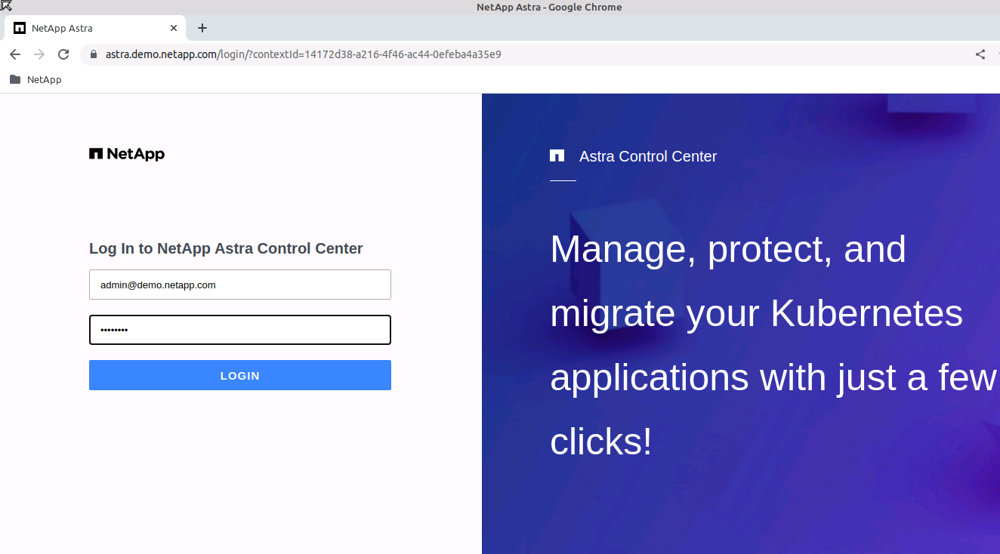
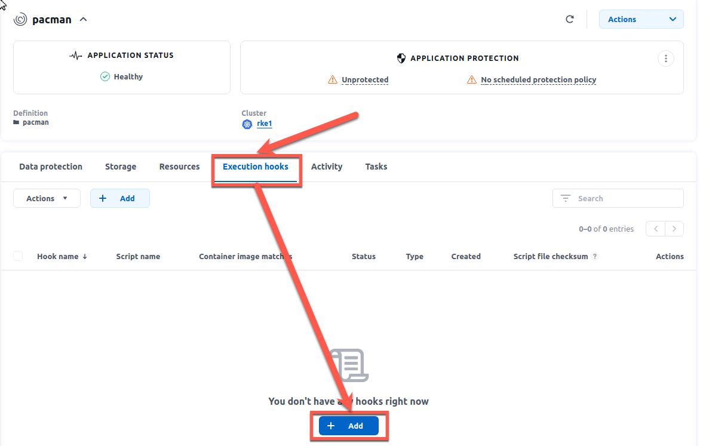

# :trident: Bonus - Protect& Recover your application with Astra Control Center 
___
**This time, no files are needed, all information is in the guide**
___
You remember the Pac-Man application we've created earlier? The one with the very very important highscore data? Having the data stored in persistent volumes is only the half of a good data management. We have also to ensure that if bad things are happening, we can recover from them. For this we will use Astra Control Centern (short ACC).   

We will use Astra Control Center to create :
- a manual snapshot (ie on-demand)
- a manual backup (ie on-demand)
- a protection policy to automatically take consistent snapshots & backups

All the work we will do in the UI can be done by API. We will work with the UI today as it is easier for demos.

To access the UI, open the webbrowser and choose NetApp Astra Control Center

<p align="center"></p>

To login use the username *admin@demo.netapp.com* and the password *Netapp1!*

<p align="center"></p>

We want to work with execution hooks to set the database of pacman into a consistent state. To use execution hooks, we first have to enable this in the ACC UI.

<p align="center"></p>

Pacman runs on RKE1, so let's discover it in ACC.  
You can either browse through the numerous namespaces already present on RKE1 (_not that many_ ...), or filter directly with the namespace name:  
<p align="center"></p>

Once you define this namespace as an ACC application, the first task run by ACC will be create a list of all resources that compose Pacman.  
Back to the applications screen of ACC, you will see a _healthy_ Pacman, which is however _not protected_ (just yet).
<p align="center"></p>

One of the many strengths of Astra Control is to integrate with the applications to protect, through hooks, in order to create consistent snapshots & backups. Some hooks are already available on this [link](https://github.com/NetApp/Verda). 
You can add the scripts while creating a new hook or as they are global anyway, you can add them before creating a hook.
Let's start to add a script for the mongo db hooks. 

<p align="center"></p>

You could paste the code directly from your clipboard or just upload a ready script.

<p align="center"></p>

The Verda repository is cloned to the user directory of the jumphost, so we can upload the script from an existing file. It is located at /user/Verda/MongoDB

<p align="center"></p>
<p align="center"></p>

After a click on "Add", you should now see the added script in your Account

<p align="center"></p>

Let's create a _pre-snapshot_ & a _post-snapshot_ hooks for the MongoDB in the pacman app as this is the underlying database used to store the scores of this game. 

First you have to go back to the application and access its details:

<p align="center"></p>

Now you have to go to the Execution Hooks section and add a new one:

<p align="center"></p>

You could decide to apply hooks to all containers of an application, or just specific containers with a filtering option. We will choose the latter & filter on `.*mongo.*` in order to manage the database. Create two hooks, one for pre-snapshot and one for post-snapshot  

<p align="center"></p>   

<p align="center"></p>

Once done, you can see that the hooks have been applied on the right container, with the _mongo:3.2_ image.
<p align="center"></p>

Let's click on the _Data Protection_ tab to create a _Protection Policy_.
<p align="center"></p>

These policies will define when you take a _snapshot_, how many you want to keep at one point in time, & how many are to the _backup_ platform.
<p align="center"></p>

We can also manually create snapshots if you dont/cant wait for the first automated snapshot to be taken.  
It is as easy as just chosing a name for this snapshot:
<p align="center"></p>

It just takes a few seconds to complete. You end up with a healthy brand new snapshot.  
<p align="center"></p>

The same applies to _backups_. Let's manually create one, based on the snapshot we just added.
<p align="center"></p>

It takes a little bit more time (couple of minutes) to complete, as there is data movement involved this time.  
Nonetheless, we end up with a healthy backup.
<p align="center"></p>

With _snapshots_, _backups_ configured, now Pacman is protected from all evil !
<p align="center"></p>

In addition to snapshots and backups, Astra Control Center is also offering a replication for DR purposes. Due to time constraints we are not covering this in the LiveLab

Now let's brake some stuff and recover it.

We currently are in a safe zone. Pacman is running. Snapshots & backups are planned, as well as mirroring.  
Similarly to most fairy tales, an evil person joins the party !

```bash
kubectl exec -it -n pacman $(kubectl get pod -n pacman -l "name=mongo" -o name) -- mongo --eval 'db.highscore.updateMany({},{$set:{name:"EVIL",cloud:"YOU",zone:"HAVE BEEN",host:"HACKED",score:"666"}});' pacman
```

<p align="center">:boom: :boom: :boom: :boom: :boom: :boom: :boom: :boom: :boom: :boom: :boom: :boom: :boom: :boom: :boom: :boom:</p>  
<p align="center"></p>
<p align="center">:boom: :boom: :boom: :boom: :boom: :boom: :boom: :boom: :boom: :boom: :boom: :boom: :boom: :boom: :boom: :boom:</p>  

As a great wise man would say: "oh oh !"  

No worries, you did all the necessary to protect your application.  
In your case, you can simply perform an _in place restore_ operation from the first manual backup you took.

For this, enter the pacman application again, go to *Data protection*, choose *backups* and click on *Restore application*.  
<p align="center"></p>

<p align="center"></p>

When clicking on _Next_, you will also need to confirm the restore operation, as you will replace the existing content with the backup.  
After a few minutes, there you go, the famous high scores are back ! It might be that the IP adress of the pacman app is changed as we did a complete restore of the application. Just do a `kubectl get svc -n pacman` to verify that you are trying to access the right IP.

<p align="center"></p>

& Once again, Astra Control saved the world from evil !

# :trident: The End :trident:

Thank you for participating in this Trident Training. We hope it was fun and you've learned something. We tried to cover the basics, there is a lot more to learn and talk. If you want to discuss further, cfeel free to reach out to us online or contact your NetApp Account Team and ask them to schedule a meeting with us.

Hendrik Land: [Linkedin](https://www.linkedin.com/in/hendrik-land/) / [E-Mail](mailto:hendrik.land@netapp.com)

Johannes Wagner: [Linkedin](https://www.linkedin.com/in/johwagner/) / [E-Mail](mailto:johannes.wagner@netapp.com)


